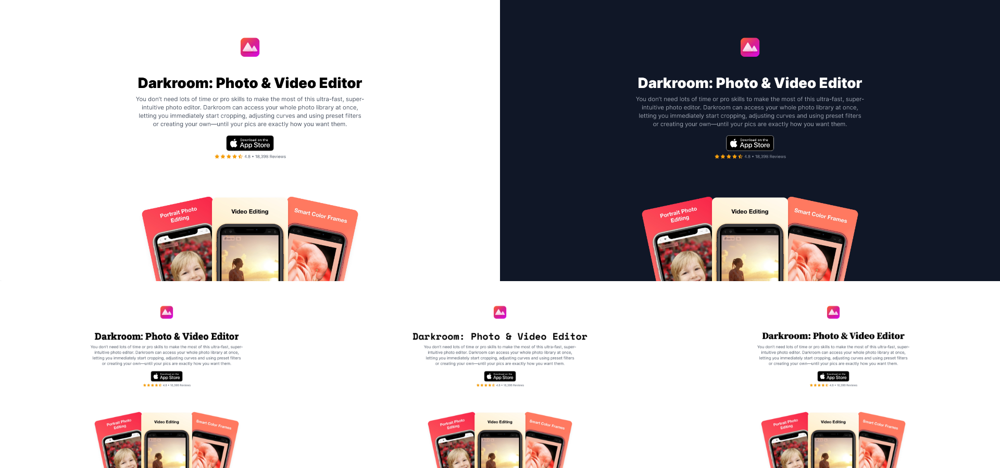

<h1 align="center">App Landing Page Gatsby Theme</h1>

<p align="center">A Gatsby theme that quickly creates a one-page website for your mobile app that has already been released.</p>

<h3 align="center">📱 ⚛️ 🚀</h3>

## Example



You can see an example of this theme in use [here](https://sharp-engelbart-a2379e.netlify.app/).

## Features

* Automatically retrieves information from the App Store
* Responsive
* Supports dark mode
* [Smart app banners](https://developer.apple.com/documentation/webkit/promoting_apps_with_smart_app_banners)
* Supports iOS App Store and Mac App Store

## Installation

```
npm i --save gatsby-theme-app-landing-page
```

```
// gatsby-config.js
module.exports = {
  plugins: [
    {
      resolve: 'gatsby-theme-app-landing-page',
      options: {
        appStoreId: 123456,
        typography: 'slab',
        appearance: 'dark',
      },
    },
  ],
};
```

## Plugin Options

The following plugin options let you control design aspects of the theme.

1. `appStoreId` (required): ID of your Apple App Store app.

2. `typography` (optional): Typeography of the headers. Default value: `sans`.

    Possible option values:

    * `sans` - [Inter](https://fonts.google.com/specimen/Inter).
    * `serif` - [Source Serif Pro](https://fonts.google.com/specimen/Source+Serif+Pro).
    * `slab` - [Roboto Slab](https://fonts.google.com/specimen/Roboto+Slab).
    * `mono` - [Space Mono](https://fonts.google.com/specimen/Space+Mono).

3. `appearance` (optional): Appearance of the theme. Default value: `auto`.

    Possible option values:

    * `light` - Light colored theme.
    * `dark` - Dark colored theme.
    * `auto` - Changes with the device display appearance setting.

## How to Contribute

If you would like to contribute to this theme, fork this repo and create a PR. You can also create an issue to fix a bug or to suggest a new feature.

## Coming Soon

* Links to social media
* Email subscribers
* Manual field override
* Platform selection
